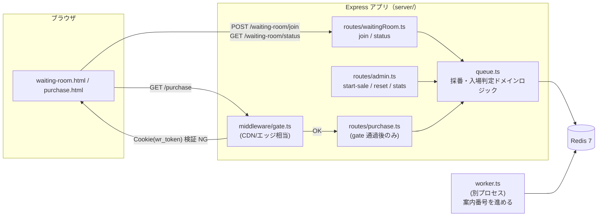
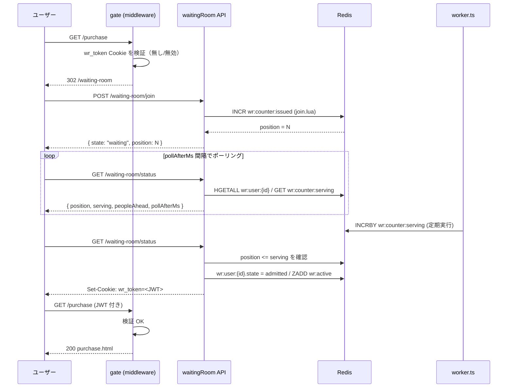

# 仮想待合室プロトタイプ — アーキテクチャ解説

このドキュメントは、`features/virtual-waiting-room/` に実装したプロトタイプの
全体像と、プロダクション環境（Cloudflare / AWS）に持っていくときにどう対応
するかを整理した学習用資料です。

## 1. 全体像

### 1-1. コンポーネント図

### 1-2. 基本フロー（発売開始後）のシーケンス

## 2. プロトタイプ ↔ プロダクション対応表

| プロトタイプ | Cloudflare | AWS |
|---|---|---|
| `middleware/gate.ts` | Workers / Waiting Room | CloudFront Functions + Lambda@Edge |
| Express の待合室 API | Workers + Durable Objects | API Gateway + Lambda |
| Redis カウンタ（`wr:counter:*`） | Durable Object / Workers KV | ElastiCache / DynamoDB Atomic Counter |
| `worker.ts` | Cron Triggers | EventBridge Scheduler + Lambda |
| 入場 JWT（`wr_token` Cookie） | Signed Cookie（エッジ検証） | CloudFront Signed Cookie / Lambda@Edge JWT 検証 |
| 静的な待合室ページ | Cloudflare Pages | S3 + CloudFront |

このプロトタイプでは `gate` も待合室 API も同じ Express プロセス内にありますが、
本番構成では **`gate` に相当する部分だけがエッジ（CDN 上）で動き、オリジンに
到達する前にリクエストを弾く** のが最大の違いです。

## 3. なぜ「エッジで弾く」ことが重要か

このプロトタイプでは `gate` ミドルウェアも Express（＝オリジン）の中で動いて
いますが、これはローカルで検証しやすくするための単純化です。本番では
`gate` に相当する判定を **CDN / エッジ（Cloudflare Workers や
CloudFront Functions）で行い、無効なリクエストをオリジンに一切到達させない**
ことが重要です。

- オリジン（購入ページのアプリケーションサーバ、DB）は「入場を許可された人数分」
  のトラフィックしか受けない設計にできる
- スパイクの大部分（トークンを持たない大量アクセス）はエッジ側で完結し、
  オリジンのスケーリング設計をシンプルにできる
- 待合室 API 自体も、Durable Object / Lambda@Edge のような「エッジに近いレイヤ」
  に置くことで、オリジンとは独立にスケールさせられる

## 4. プレキューの意義

`wr:sale:started == "0"` の間は整理番号を発行せず、`wr:prequeue` に
ただ集めるだけにしているのには理由があります。

1. **F5 連打・先行接続で有利にならない**
   発売前にどれだけ早くアクセスしても整理番号には反映されない（プレキューは
   Set であり順序を持たない）ため、発売時刻ちょうどに操作を集中させる
   インセンティブが薄れ、開始直前のスパイクそのものが起きにくくなる。

2. **「早く並ぶ Bot」の投資対効果を消す**
   先着有利が成立しないので、Bot 側は「誰よりも早く 1 接続を確立する」戦略が
   意味を持たなくなる。結果として Bot は「アカウント数を増やして母数で稼ぐ」
   戦略に切り替えざるを得ず、そこは別レイヤ（レート制限・CAPTCHA・デバイス
   指紋など）で対処すべき問題として切り分けられる。**このプロトタイプは
   Bot 検知そのものは実装していない**（非ゴール）。

3. **瞬間ピークを均す**
   発売時刻に集中していたアクセスが「シャッフル後、`ADMIT_RATE_PER_SEC`
   人／秒で一定に消化される」流れに変わるため、オリジンが瞬間最大値ではなく
   平均値に対して容量設計できるようになる。

4. **公平性**
   回線速度や地理的距離（CDN からの物理的な近さ）による有利不利が、
   ランダムシャッフルによって排除される。

## 5. トレードオフと未対応事項

このプロトタイプで意図的に省略・単純化している点です。実運用に持っていく
場合は以下を追加検討する必要があります。

- **トークン共有・リンク流出**: `wr_token` を含む URL や Cookie が漏れると
  他人が横取りできてしまう。実運用ではデバイス指紋との紐付けや、一度しか
  使えないワンタイムトークンの検討が必要。
- **複数 ID 取得による水増し**: `wr_uid` は単なる Cookie ベースの ID なので、
  Cookie を消せば何度でも新規参加できてしまう。レート制限、Turnstile/CAPTCHA、
  デバイス指紋との併用が現実的な対策になる。
- **ポーリング vs SSE/WebSocket**: 本実装はシンプルさを優先してポーリング
  （`pollAfterMs` による動的間隔調整付き）を採用したが、接続数が多い場合は
  SSE や WebSocket の方がオリジンへの総リクエスト数を抑えられる可能性がある。
  一方でエッジ側での接続保持コストとのトレードオフになる。
- **Redis 単一障害点**: このプロトタイプの Redis は単一インスタンスであり、
  再起動するとデータが消える（`.env` にも永続化設定はない）。本番では
  Redis Cluster や、Cloudflare Durable Object のような「単一ライターだが
  高可用」な設計への発展が必要になる。

## 6. Redis キー設計（実装リファレンス）

| キー | 型 | 用途 |
|---|---|---|
| `wr:sale:started` | String (`"0"`/`"1"`) | 発売開始フラグ |
| `wr:prequeue` | Set | 発売前に到着したユーザー ID の集合（順序を持たせない） |
| `wr:counter:issued` | String (数値) | 発行済み整理番号の最大値 |
| `wr:counter:serving` | String (数値) | 現在の案内番号 |
| `wr:user:{userId}` | Hash | `{ state, position, joinedAt, admittedAt }` |
| `wr:active` | Sorted Set | 入場中セッション（score = 有効期限） |

`join.lua` が `wr:user:{id}` の存在チェックと状態遷移をアトミックに行い、
`startSale.lua` が `wr:prequeue` のシャッフルと `wr:sale:started` / 
`wr:counter:issued` の更新をアトミックに行うことで、進行中の `join` との
競合（番号の重複・飛び番）を防いでいます。
